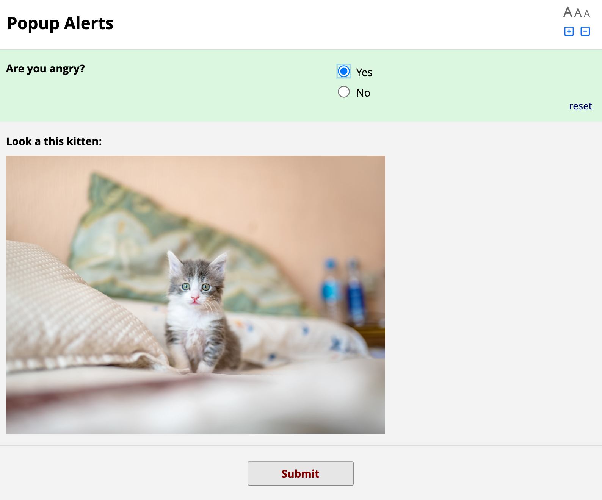
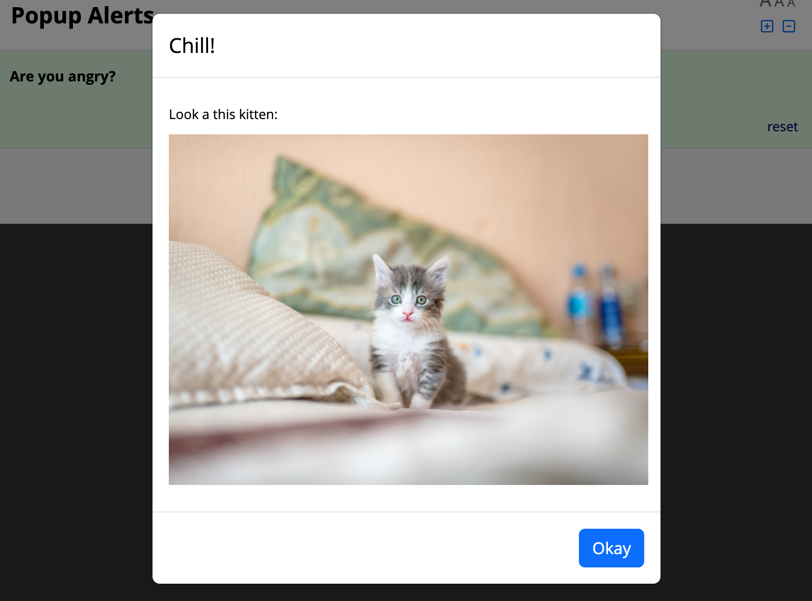

# REDCap Popup Alerts

[](https://doi.org/10.5281/zenodo.13161707)

This module allows the content of descriptive text fields to be displayed as an alert in a popup window for better visibility.

When annotated with `@ALERT` it will display the field's label as the content of a popup alert when the field becomes visible due to branching logic. The field is also then hidden, so as not to duplicate the information.

Go from this:



To this:



The popup window has a default title of "Alert". This can be overridden for each field by using `@ALERT="Custom title"`.

## Installation

Install the module from the REDCap module repository and enable in the Control Center, then enable on projects as needed.

## Usage

This module adds one action tag:

| Action Tag | Description |
| --- | --- |
| @ALERT | Displays the field's label as the content of a modal popup when the field becomes visible due to branching logic. The field is also then hidden, so as not to duplicate the information. The modal can be given a custom title by @ALERT="Custom title". Otherwise it will have a default title of "Alert". |

## Configuration

This module can be configured with the following project settings:

| Setting | Default Value | Description |
| --- | --- | --- |
| Enabled | False | Enable or disable the module settings. Useful to disable without removing it from projects altogether. |
| Modal title | "Alert" | Title of the popup window showing any requested or required fields. |
| Okay button text | "Okay" | Text for okay button. |

## CSS customisation

The popup modal can be styled using CSS by targeting its id and class attributes in the DOM. Furthermore, a popup window also has a class injected into its outer div, which is based on the descriptive text field that triggered the popup. For example, if a descriptive text field called `my_field` is transformed into a popup, then the popup will have the class `my_field-popup`. This allows specific styling to be applied to different popups.

## Internationalisation

This module supports translation via the REDCap External Module Framework's Internationalisation (i18n) features. All configuration options, default popup window title and Okay button text, and module name and description, may be translated by duplicating the file `lang/English.ini` to your local language and replacing the values of each text parameter. If you translate this module to a new language, consider contributing your translation to this repository so that it can be included in future releases for other sites.

## Citation

If you use this external module for a project that generates a research output, please cite this software in addition to [citing REDCap](https://projectredcap.org/resources/citations/) itself. You can do so using the APA referencing style as below:

> Wilson, A. (2024). REDCap Popup Alerts [Computer software]. https://github.com/jangari/redcap_popup_alerts https://doi.org/10.5281/zenodo.13161707

Or by adding this reference to your BibTeX database:

```bibtex
@software{Wilson_REDCap_Popup_Alerts_2024,
  title        = {{REDCap Popup Alerts}},
  author       = {Wilson, Aidan},
  year         = 2024,
  month        = 8,
  url          = {https://github.com/jangari/redcap_popup_alerts}
}
```
These instructions are also available in [GitHub](https://github.com/jangari/redcap_popup_alerts/) under 'Cite This Repository'.

